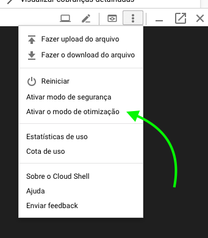
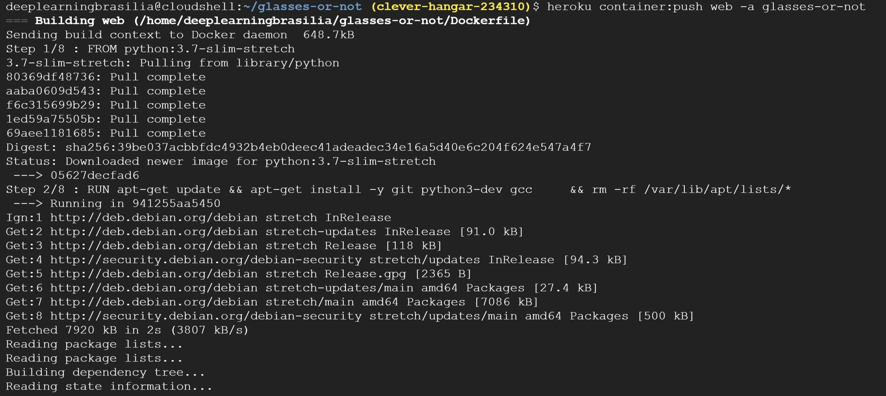

# Deploy do seu modelo fastai no Heroku (Web App)

## Agradecimento

[Texto de introdução](https://github.com/piegu/glasses-or-not/edit/master/README.md) e [tutorial](https://github.com/piegu/glasses-or-not/blob/master/tutorial/Web_app_fastai.md)...
- (muito, muito, muito) inspirado do [trabalho](https://github.com/weltonrodrigo/fastai-v3) do [Welton Rodrigo Torres Nascimento](https://github.com/weltonrodrigo) (até cópias/colas de seus textos porque não fazia sentido modificá-los)
- (muito, muito) inspirado do [trabalho](https://github.com/render-examples/fastai-v3) do [Anurag Goel](https://github.com/anurag)
- (muito) inspirado do [trabalho](https://github.com/nikhilno1/healthy-or-not/blob/master/heroku-deploy.md) do [Nikhil](https://github.com/nikhilno1)

Muito obrigado a eles!

## Colocar na Internet o seu modelo baseado em fastai 

Existem várias formas de colocar na Internet o seu modelo baseado em fastai. A página de informações do curso mostra diversas opções:

* [Render](https://course.fast.ai/deployment_render.html)
* [Google App Engine](https://course.fast.ai/deployment_google_app_engine.html)
* [AWS Lambda](https://course.fast.ai/deployment_aws_lambda.html)
* [Amazon SageMaker](https://course.fast.ai/deployment_amzn_sagemaker.html)
* [AWS BeanStalk](https://course.fast.ai/deployment_aws_beanstalk.html)
* [Microsoft Azure Functions](https://course.fast.ai/deployment_azure_functions.html)

Com certeza, uma opção que se destaca é o Render.com ([tutorial online](https://course.fast.ai/deployment_render.html)), 
que é uma plataforma criada pelo mesmo criador do [Crestle](https://crestle.ai/) mas uma outra opçao é usar gratuitamente o Heroku.

## 1) Exporte o modelo treinado

Gere o seu modelo normalmente e salve o `export.pkl` com `learn.export()`.

Coloque que arquivo no google drive ou dropbox (porque é de graça). É necessário gerar um link para o arquivo usando um dos dois serviços abaixo:

- Google Drive: Use [este gerador de links](https://www.wonderplugin.com/online-tools/google-drive-direct-link-generator/).
- Dropbox: Use [este gerador de links](https://syncwithtech.blogspot.com/p/direct-download-link-generator.html).

## 2) Ajuste a aplicação pré-pronta

Faça um fork no github deste repositório base, que contém uma aplicação pré-pronta e customizável.

Edite, no próprio Github, o arquivo [app/server.py](https://github.com/piegu/glasses-or-not/blob/master/app/server.py) para incluir:

1. O endereço do `export.pkl` em `export_file_url`.
2. Troque o nome das classes geradas pelo seu modelo em `classes = ['with_glasses', 'without_glasses']`.
3. Lembre-se de usar a opção "Commit directly to the master branch".
4. Edite também o texto que aparece para os usuários da sua aplicação, no arquivo [app/views/index.html](https://github.com/piegu/glasses-or-not/blob/master/app/view/index.html):
    1. O título (tag `<title>`)
    2. O cabeçalho (`div class='title'`) e a explicação (tag `
`)
5. E pronto!

## 3) Deploy no Heroku

Apesar de ser gratuito, o deploy no Heroku exige passos adicionais, que devem ser repetidos manualmente **sempre que o código da aplicação for alterado na Github**.

Normalmente o deploy no Heroku exige apenas o código da aplicação, mas, no caso dos modelos do fastai, ela é grande demais para o método tradicional e exige o **deploy em containers docker**. Para isso, é necessário executar os comandos numa máquina com docker instalado.

No entanto, como estamos usando uma máquina do Google Cloud para gerar o modelo, podemos usar o Cloud Shell para fazer o deploy.

### 3.1) Acesse o console do Google Cloud

Os passos a seguir consideram que você já tem uma conta no gcloud.

1. Acesse o dashboard em [https://console.cloud.google.com/home/dashboard](https://console.cloud.google.com/home/dashboard).
2. Abra o Cloud Shell no topo da página:

    

3. Ative o modo de otimização. Ele faz com que o Cloud Shell rode numa máquina mais potente e permita o build do container.

    

4. Instale o cliente da heroku:

    `curl https://cli-assets.heroku.com/install.sh | sh`

    

5. Faça o clone da aplicação modificada e entre no diretório. Note que o seu endereço vai ser diferente do meu.

    `git clone https://github.com/piegu/glasses-or-not.git`

    
    
6. Entre na pasta do seu modelo. Note que o nome da sua pasta vai ser diferente do meu.

    `cd glasses-or-not`

    

7. Faça o login no heroku:

    `heroku login`
    
    O cliente heroku vai pedir que você aperte enter e depois apresentar um link para ser aberto na internet. Esse link vai te levar para a página de login. Nessa tela você pode fazer seu cadastro se ainda não tiver. Depois da autenticação bem sucedida, o cliente vai informar que está logado.

    

8. Crie um novo app no Heroku para receber sua aplicação:

    `heroku create -a <app-name>`

    O nome da aplicação também vai ser o endereço dela na Internet. No exemplo acima, seria nome-da-aplicacao.app.herokuapp.com. Caso você não queira um nome específico, ele vai criar um nome aleatório.

    

9. É necessário informar ao cliente docker como fazer o login no heroku, mas o próprio cliente toma conta disso:

    `heroku container:login`

    

10. Agora para construir e enviar o container para o heroku. Isso deve levar em torno de 5 minutos. O print abaixo mostra só o começo do texto de saída gerado pelo comando.

    `heroku container:push web -a <app-name>`

    

    Se a construção e envio forem bem sucedidos, deve gerar uma saída parecida com esta:

    

11. Agora é necessário informar o keroku que faça o deploy propriamente dito do container criado:

    `heroku container:release web -a <app-name>`

    

12. Acesse seu aplicativo.

    `heroku open'
    
    Se isso não abrir a janela do navegador, seu aplicativo já estará disponível em https://<nome_da_aplicação>.herokuapp.com. No nosso exemplo em https://glasses-or-not.herokuapp.com/
